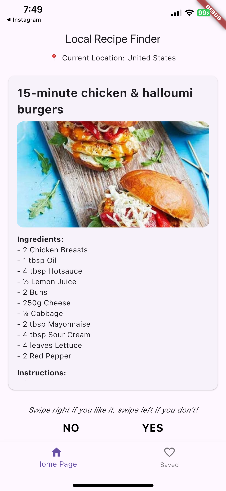
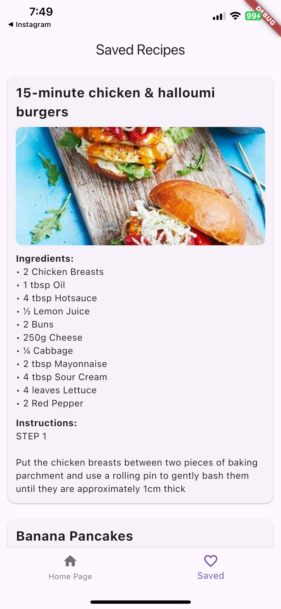
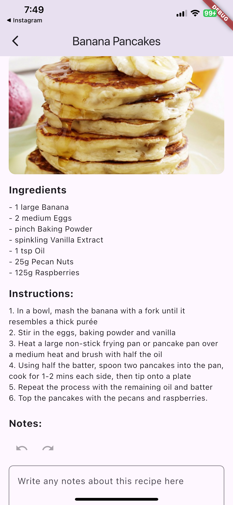

# Local Recipe Finder

**Local Recipe Finder** is a Flutter app that helps users discover recipes based on their current location. Swipe right to save favorite recipes and browse your saved collection anytime. 

## Features
- Fetches recipes relevant to the user's GPS location
- Swipe cards interface for liking (saving) or skipping recipes
- View and manage your saved recipes with notes
- Undo/redo functionality for recipe saves and notes
- Accessibility support with semantic labels and voiceover compatibility

## Screenshots




## Technologies Used
- Flutter & Dart
- Provider for statement management
- Isar for local data persistence
- Geolocator for locaton services

## Project Structure
```text
lib/
├── main.dart
├── models/
│   └── recipe.dart
|   └── recipe.g.dart
├── providers/
│   └── local_recipe_finder_provider.dart
|   └── notes_provider.dart
|   └── position_provider.dart
├── views/
│   ├── home_page.dart
│   └── saved_page.dart
|   └── recipe_details_page.dart
└── utils/
    └── location_utils.dart
```
## Requirements

This app works best on an iphone (iOS). It has not been tested thoroughly on an Android or MacOS and it does not work on a Chrome browser. So, it is required to use the app on an iphone. It is also required that for the app to work correctly, to allow the app to access your gps location and for the device to be connected to the internet.

All the dependencies in the app can be viewed in `pubspec.yaml`. Notably, some are flutter, geolocator, uuid, shared_preferences, and http. The instructions for installing these dependencies are listed in the above section. There are no API keys required for this app.

## How to build and run the app

1. **Clone the repo**
 ```bash
 git clone TODO
 `cd code/local_recipe_finder`
 ```
2. **Install dependencies**
  ```bash
  `flutter pub get`
  ```
3. **Install CocoaPods**
   ```bash
   cd code
   cd local-recipe-finder
   cd ios
   pod install
   ```
4. **Run the app**

To run it in release mode:
```bash
flutter run --release
```
To run it locally:
```bash
flutter run
```

## Team Members
- Lauren Tra
- Jaime White
- Kevin Hernandez
- Medha Gupta
